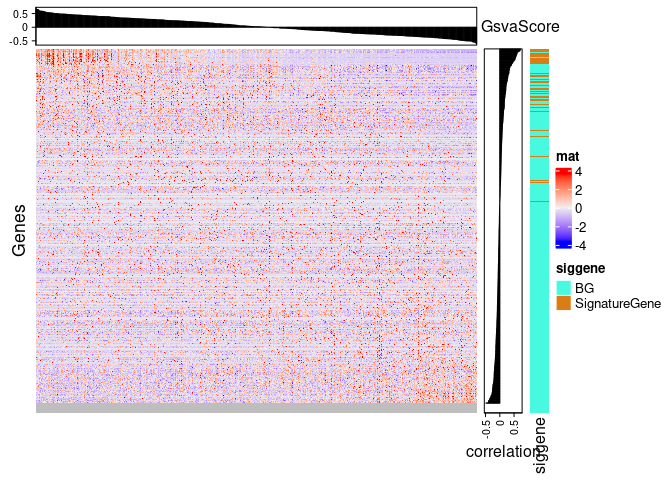
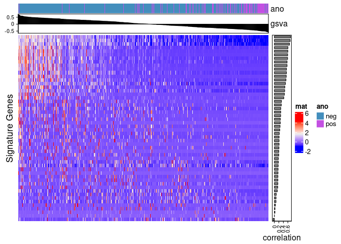

<!-- README.md is generated from README.Rmd. Please edit that file -->

# evalGSVAsig

<!-- badges: start -->
<!-- badges: end -->

The goal of evalGSVAsig is to identify which genes are contributing most
to a GSVA score.

## Installation

You can install the development version of evalGSVAsig from
[GitHub](https://github.com/) with:

``` r
# install.packages("devtools")
devtools::install_github("lkroeh/evalGSVAsig")
```

## Example

This is a basic example which shows the format of the data:

``` r
library(evalGSVAsig)

#example gene list
sig <- c("GENE1", "GENE2", "GENE3")
signature_list <- c(list(sig))
names(signature_list) <- c("signature1")

#run function
output <- evalGSVAsig::GSVAsignatureRanking(eset, signature_list)

#view output
#print df of genes ordered by correlation to GSVA scores
output[[1]]

#show heatmap of ALL gene expression in relation to GSVA score
output[[2]]

#show heatmap of SIGNATURE gene expression in relation to GSVA score
output[[3]]

#get expression with GSVA scores saved in pData
output[[4]]
```

With sample data:

``` r
#with our sample data
data(signatures)
data(eset)

output <- evalGSVAsig::GSVAsignatureRanking(eset = eset, signature = signatures, metacol = 'hpv_status')
```

View tables:

``` r
#This table contains all genes
head(output[[1]])
#>     correlation   gene rank
#> 470   0.7223057 WFDC12    1
#> 75    0.7145882 ASPRV1    2
#> 481   0.7058520  LCE3E    3
#> 458   0.6744871   DSC1    4
#> 234   0.6293875   DSG1    5
#> 454   0.6065752   ARG1    6
#This table contains only signature genes
head(output[[2]])
#>     correlation   gene rank
#> 470   0.7223057 WFDC12    1
#> 481   0.7058520  LCE3E    3
#> 458   0.6744871   DSC1    4
#> 454   0.6065752   ARG1    6
#> 483   0.6016642  LCE2C    7
#> 465   0.5928593  LCE2B    8
```

View heatmap that plots all signature and non-signature genes:

``` r
output[[3]] 
```



View heatmap that plots only signature genes:

``` r
output[[4]]
```


